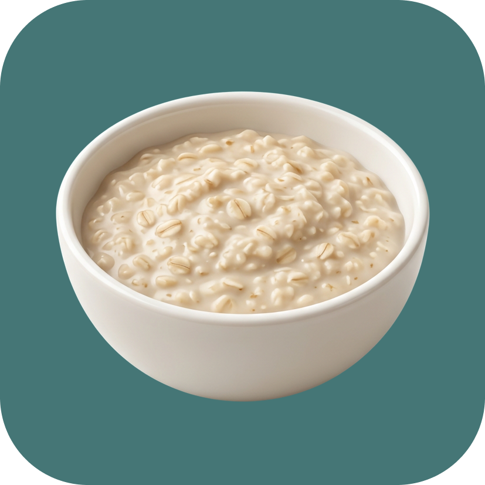

  

<h1 align="center">Oatmeal</h1>

  Open-source, fully local alternative to <a href="https://granola.ai">Granola</a> for macOS. 
  AI meeting transcription — no bots, no cloud, no account.

  

---

Oatmeal sits next to your call, transcribes both sides of the conversation in real time, and saves everything as plain Markdown files you own and control. No audio ever leaves your Mac.

## Features

- **Live transcription** — see both sides of the conversation as it happens, powered by [Parakeet-TDT](https://huggingface.co/nvidia/parakeet-tdt-0.6b-v2) running on Apple Neural Engine
- **Speaker diarization** — automatically identifies who said what, with offline re-diarization when the meeting ends for improved accuracy
- **Editable speaker names** — click any speaker label to rename it; set your own name once in Settings
- **Invisible to the other side** — the app window is hidden from screen sharing by default, so no one knows you're using it
- **Works with everything** — Zoom, Google Meet, Teams, Slack, or any app that plays audio through your Mac
- **AI-powered meeting notes** — optional summaries with key takeaways, action items, and next steps via OpenRouter (GPT-4o, Claude, Gemini, etc.)
- **Meeting templates** — pre-built formats for general meetings, customer discovery, 1:1s, and interviews
- **Auto-saved sessions** — every meeting is automatically saved as Markdown and JSON to a local vault
- **Local API** — built-in HTTP API for integrating with other tools
- **100% local by default** — speech recognition runs entirely on your Mac; cloud LLM is optional and only used for post-meeting summaries if you configure it

## Download

Grab the latest DMG from the [Releases page](https://github.com/st-imdev/oatmeal-meeting-notes/releases/latest).

1. Open the DMG and drag Oatmeal to Applications
2. Launch the app and grant **microphone** and **screen capture** permissions
3. Click **New Meeting** (or `Cmd+N`)
4. Talk — the transcript builds live
5. Click **Stop** when you're done

The first launch downloads the speech model (~600 MB). After that, everything runs offline.

### Optional: AI meeting notes

1. Open **Settings** (`Cmd+,`)
2. Add your [OpenRouter](https://openrouter.ai/) API key
3. After each meeting, Oatmeal generates a structured summary with headline, key takeaways, action items, and next steps

### Optional: Set your name

1. Open **Settings** → **Your Name**
2. Type your name — it replaces "Me" in all transcripts

## How it works

1. You start a meeting and click **New Meeting**
2. Oatmeal captures your microphone and system audio simultaneously
3. Speech is transcribed locally using Parakeet-TDT via [FluidAudio](https://github.com/FluidInference/FluidAudio)
4. Voice Activity Detection (Silero VAD) segments speech from silence
5. Speaker diarization identifies distinct speakers in system audio
6. When you stop, a full-context re-diarization pass refines speaker labels
7. Everything is saved as `meeting.md`, `transcript.md`, `transcript.json`, and `meta.json`

## Privacy

- **Audio never leaves your Mac** — transcription runs on-device via Apple Neural Engine
- **No account required** — no sign-up, no login, no telemetry
- **No bots join your calls** — Oatmeal captures system audio directly via ScreenCaptureKit
- **API keys stored in Keychain** — OpenRouter key (if configured) is stored securely in macOS Keychain
- **Transcripts stored locally** — saved to `~/Documents/Oatmeal/Meetings/` as plain files
- **Hidden from screen sharing** — app windows are invisible to screen share by default during recording

## Requirements

- Apple Silicon Mac
- macOS 15+

## Credits

Built on top of [FluidAudio](https://github.com/FluidInference/FluidAudio) — Parakeet-TDT ASR, Silero VAD, and speaker diarization. Inspired by [OpenGranola](https://github.com/yazinsai/OpenGranola) and [Granola](https://granola.ai).

## License

MIT
